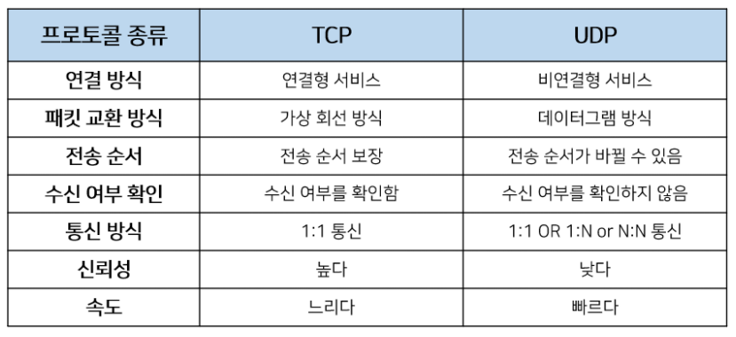

# Network

## 1. OSI 7계층

​	Open Systems Interconnection의 약자로 개방형 시스템이라는 뜻


* 각 계층은 하위 계층의 기능만을 이용하고, 상위 계층에게 기능을 제공한다.

* '[프로토콜](공통의 데이터 교환 방법 및 순서에 대해 정의한 의사소통 약속, 규약 혹은 규칙 체계를 말한다.) 스택' 혹은 '스택'은 이러한 계층들로 구성되는 프로토콜 시스템이 구현된 시스템을 가리키는데, 프로토콜 스택은 하드웨어나 소프트웨어 혹은 둘의 혼합으로 구현될 수 있다.

* 일반적으로 하위 계층들은 하드웨어로, 상위 계층들은 소프트웨어로 구현된다.

  


### 1. 물리 계층(Physical layer)

* 단말기기와 전송매체 사이의 인터페이스를 정의하고 상위 계층 엔티티 간의 비트 전송을 위한 기계적, 전기적, 기능적, 절차적인 수단을 제공하는 계층. 즉, 이진 데이터를 어떤 시그마로 만들고, 신호를 주고 받기 위한 전기적, 전파적 특성을 정의하는 계층

* 네트워크의 기본 네트워크 하드웨어 전송 기술을 이룬다.

* 전송 단위는 Bit이다.

* 물리 계층에서 가장 많이 고민하는 사항은 대역폭과 전송효율

* 단지 데이터를 전달만 할 뿐 이 데이터가 무엇인지, 어떤 에러가 있는지, 어떻게 보내는 것이 더 효과적인지는 전혀 관혀하지 않는다.

  


### 2. 데이터 링크 계층(Data link layer)

* 잡음이 없는 인접한 노드 간의 물리적인 회선을 상위 계층이 사용할 수 있도록 전송에러가 없는 통신 채널로 변화시키는 계층

* 포인트 투 포인트(Point to Point) 간 신뢰성있는 전송을 보장하기 위한 계층으로 [CRC](순환 중복 검사(Cyclic Redundancy Check) : 네트워크 등을 통하여 데이터를 전송할 때 전송된 데이터에 오류가 있는지를 확인하기 위한 체크값을 결정하는 방식 ) 기반의 오류 제어와 흐름 제어가 필요하다.

* 주소 값은 물리적으로 할당 받는데, 이는 네트워크 카드가 만들어질 때부터 [맥 주소(MAC address)]( 네트워크 세그먼트의 데이터 링크 계층에서 통신을 위한 네트워크 인터페이스에 할당된 고유 식별자)가 정해져 있다는 뜻이다.

* 데이터 전송 단위는 Frame이다.

  


### 3. 네트워크 계층(Network layer)

* [논리적인 주소](IP주소, IPX주소, 컴퓨터 이름 등)를 담당하고 패킷의 전달 경로를 결정하는 계층

* 다양한 길이의 데이터를 네트워크들을 통해 전달하고, 그 과정에서 전송 계층이 요구하는 서비스 품질(QoS)을 제공하기 위한 기능적, 절차적 수단을 제공

* [라우팅](단말기 혹은 컴퓨터가 어떤 네트워크에 접속되어 있을 때 송신하고자 하는 정보가 네트워크를 통해서 어떻게 상대방 수신측까지 전달되는가를 제어하는 일을 담당. 즉, 발신에서 착신까지의 패킷의 경로를 제어), 흐름 제어, 세그멘테이션(segmentation/desegmentation), 오류 제어, 인터네트워킹(Internetworking) 등을 수행

* 네트워크 관리자가 직접 주소(IP)를 할당하는 구조를 가지며, 계층적(hierarchical)이다.

* 데이터 전송 단위는 Datagram(Packet)이다.

  


### 4. 전송 계층(Transport layer)

* 양 끝단(End to end)의 사용자들이 투명하고 신뢰성 있는 데이터를 주고 받을 수 있도록 해주어, 상위 계층들이 데이터 전달의 유효성이나 효율성을 생각하지 않도록 해주는 계층

* 시퀀스 넘버 기반의 오류 제어 방식을 사용한다.

* 전송 계층은 특정 연결의 유효성을 제어하고, 일부 프로토콜은 상태 개념이 있고(stateful), 연결 기반(connection oriented)이다. (이는 전송 계층이 패킷들의 전송이 유효한지 확인하고 전송 실패한 패킷들을 다시 전송한다는 것을 뜻한다.)

* 가장 잘 알려진 전송 계층의 예는 [TCP](전송 제어 프로토콜(Transmission Control Protocol))이다.

* 데이터 전송 단위는 Segment이다.

  


### 5. 세션 계층(Session layer)

* 양 끝단의 응용 프로그램 간의 연결을 성립하게 하고 연결이 안정되게 유관리하며 작업 완료 후 연결을 끊는 역할을 하는 계층. 즉, 데이터 교환과 에러 발생 시 복구를 담당

* TCP/IP 세션을 만들고 없애는 책임을 진다.

  

### 6. 표현 계층(Presentation layer)

* 코드 간의 번역을 담당하여 사용자 시스템에서 데이터의 형식상 차이를 하나의 통일된 형식으로 변환시켜 응용 계층의 부담을 덜어 주는 계층
* MIME 인코딩이나 암호화 등의 동작이 이 계층에서 이루어진다.


### 7. 응용 계층(Application layer)

* 응용 프로세스와 직접 관계하여 일반적인 응용 서비스를 수행하는 계층
* 일반적인 응용 서비스는 관련된 응용 프로세스들 사이의 전환을 제공한다.


### 계층을 나눈 이유?

통신이 일어나는 과정을 단계별로 파악하고 특정한 곳에 이상이 생기면 다른 단계를 건들지 않고 이상이 생긴 단계만 고칠 수 있게 하여 문제 해결을 용이하게 해준다.

즉, 상위 계층의 프로토콜이 제대로 동작하기 위해서는 하위의 모든 계층이 문제가 없어야 하기 때문에, 문제가 생긴 계층을 정확하게 파악할 수 있다.


### 네트워크 장비

1. 리피터

   * 1계층에서 작동

   * 네트워크 선로를 통해 전달되는 신호를 증폭하여 연결된 네트워크로 전송하는 장치

2. 허브

   * 1계층에서 작동

   * 리피터에 여러 개의 포트를 장착한 것으로 이더넷 네트워크에서 여러 대의 컴퓨터, 네트워크 장비를 연결하는 장치이다.
   * 충돌 도메인이 분리되지 않아 여러명이 사용할 경우 느려진다.

3. 브리지

   * 2계층에서 작동

   * 동일한 프로토콜을 사용하거나 다른 프로토콜을 사용하는 LAN을 연결하는 장치, 물리 계층 및 데이터 링크층(MAC계층)의 연결기능 제공
   * 소프트웨어 방식으로 스위치보다 속도가 떨어지고, 포트 수도 적다.

4. 스위치

   * 2계층에서 작동

   * 허브와 같이 포트에 들어온 신호를 다른 포트에 전송하는 장비
   * 허브는 모든 포트에 전송을 하지만 스위치는 프레임 필터링, MAC 주소를 가지고 데이터를 보내고자 하는 포트에만 신호를 전달하기 때문에 충돌 도메인이 분리되어 여러명이 동시에 사용해도 느려지지 않는다.
   * 하드웨어 방식으로 브리지보다 속도가 빠르고, 포트 수도 많다.

5. 라우터

   * 3계층에서 작동

   * 다른 기종간의 네트워크를 연결하는 장비로 외부와 내부의 네트워크를 연결한다(LAN과 WAN). 물리계층, 데이터 링크 계층, 네트워크 계층 간을 연결하고 네트워크의 가장 트래픽이 적은 경로를 찾아 목적지로 데이터를 전송(브리지 + 경로 배정의 역할

6. 게이트웨이

   * 컴퓨터 네트워크에서 서로 다른 통신망, 프로토콜을 사용하는 네트워크 간의 통신을 가능하게 하는 컴퓨터나 소프트웨어를 두루 일컫는 용어로 로 다른 네트워크 상의 통신 프로토콜을 적절히 변환한다.
   * 7계층 가운데 어느 곳에서도 동작이 가능하므로 전송방식이 다른 통신망도 흡수함으로써 서로 다른 기종끼리도 접속을 가능하게 한다.


## 2. TCP/IP의 개념

패킷 통신 방식의 인터넷 프로토콜인 IP (인터넷 프로토콜)와 전송 조절 프로토콜인 TCP (전송 제어 프로토콜)로 이루어져 있다. IP는 패킷 전달 여부를 보증하지 않고, 패킷을 보낸 순서와 받는 순서가 다를 수 있다.(unreliable datagram service) TCP는 IP 위에서 동작하는 프로토콜로, 데이터의 전달을 보증하고 보낸 순서대로 받게 해준다. HTTP, FTP, SMTP 등 TCP를 기반으로 한 많은 수의 애플리케이션 프로토콜들이 IP 위에서 동작하기 때문에, 묶어서 TCP/IP로 부르기도 한다. 즉, IP가 데이터의 배달을 처리한다면 TCP는 패킷을 추적 및 관리한다.


### 1. IP(Internet Protocol)

송신 호스트와 수신 호스트가 패킷 교환 네트워크(Packet Switching Network)에서 정보를 주고받는 데 사용하는 정보 위주의 규약(프로토콜)이며, OSI 네트워크 계층에서 호스트의 주소지정과 패킷 분할 및 조립 기능을 담당한다.

* IP의 정보는 [패킷](전송하고자 하는 데이터의 한 블록(Payload)과 주소지 정보(방신지 주소, 목적지 주소), 관리정보(Header, IPv6에서와 같이 네트워크가 패킷을 목적지까지 전달하는 데 필요한)로 구성된다. 각각의 패킷은 일정한 헤더가 필요하며 패킷은 적절한 크기로 나뉜다.) 혹은 데이터그램이라고 하는 덩어리로 나뉘어 전송된다. IP에서는 이전에 통신한 적 없는 호스트에 패킷을 보낼 때 경로 설정이 필요없다.

* IP는 비신뢰성(unreliability)과 비연결성(connectionlessness)이 특징이다. 비신뢰성은 흐름에 관여하지 않기 때문에 보낸 정보가 제대로 갔는지 보장하지 않는다는 뜻이다. 예를 들어 전송과정에서 패킷이 손상될 수도 있고, 같은 호스트에서 전송한 패킷의 순서가 뒤죽박죽이 될 수도 있고, 같은 패킷이 두 번 전송될 수도 있으며, 아예 패킷이 사라질 수도 있다. 패킷 전송과 정확한 순서를 보장하려면 TCP 프로토콜과 같은 IP의 상위 프로토콜을 이용해야 한다.

* IPv6 (Internet Protocol version 6)

  IPv4 프로토콜의 주소가 32비트라는 제한된 주소 공간 및 국가별로 할당된 주소가 거의 소진되고 있다는 한계점으로 인해 지속적인 인터넷 발전에 문제가 예상되어, 이에 대한 대안으로서 IPv6 프로토콜이 제안되었다.

  IPv6와 기존 IPv4 사이의 가장 큰 차이점은 바로 IP 주소의 길이가 128비트로 늘어났다는 점이다. 여러가지 새로운 기능을 제공하는 동시에 기존 IPv4와의 호환성을 최대로 하는 방향으로 설계되었다.

  

### 2. TCP(Transmission Control Protocol)

TCP는 연결된 컴퓨터에서 실행되는 프로그램 간에 일련의 [옥텟](8bit = byte)을 안정적으로, 순서대로, 에러없이 교환할 수 있게 한다. 네트워크의 정보 전달을 통제하는 프로토콜이자 인터넷을 이루는 핵심 프로토콜 중 하나이다.

 

* 한 경로로 움직인다.

* TCP는 데이터 스트림으로부터 데이터를 받아 들여 이것을 청크 단위로 분할한 뒤 TCP 헤더를 덧붙여 TCP 세그먼트를 생성한다. TCP 세그먼트는 IP 데이터그램을 캡슐화하여 상대방과 주고 받게 된다.
* TCP의 작동은 크게 세 가지 흐름으로 구분한다.
  1. 연결 생성
  2. 자료 전송
  3. 연결 종료
* 연결형 서비스로 가상 회선 방식을 제공한다. 3-way handshaking을 통해 연결을 설정하고, 4-way handshaking을 통해 연결을 해제한다.
* 흐름제어
  * 데이터를 송신하는 곳과 수신하는 곳의 데이터 처리 속도를 조절하여 수신자의 버퍼 오버플로우를 방지한다.
  * 송신하는 곳에서 감당이 안되게 많은 데이터를 빠르게 보내 수신하는 곳에서 문제가 일어나는 것을 막는다.
* 혼잡제어
  * 네트워크 내의 패킷 수가 넘치게 증가하지 않도록 방지한다.
  * 정보의 소통량이 과다하면 패킷을 조금만 전송하여 혼잡 붕괴 현상이 일어나는 것을 막는다.
* UDP보다 속도가 느리다.
* 전이중(Full-Duplex), 점대점(Point to Point) 방식이다.
  * 전이중 : 전송이 양뱡항으로 동시에 일어날 수 있다.
  * 점대점 : 각 연결이 정호가히 2개의 종단점을 가지고 있다.

* 연속성보다 신뢰성있는 전송이 중요할 때에 사용된다.

  * Streaming 서비스에 불리하다.(손실된 경우 재전송 요청을 하므로)

   


## 3. UDP(User Datagram Protocol)

데이터를 [데이터그램](독립적인 관계를 지니는 패킷) 단위로 처리하는 프로토콜이다. TCP와 달리 UDP는 비연결형 프로토콜이기 때문에 연결을 위해 할당되는 논리적인 경로가 없다. 


* 각각의 패킷은 독립적인 관계를 지니고 데이터를 서로 다른 경로로 독립적으로 처리한다.

* 정보를 주고 받을 때 정보를 보내거나 받는다는 신호절차를 거치지 않는다.
* 신뢰성이 낮다.
* TCP보다 속도가 빠르다.
* 신뢰성보다는 연속성이 중요한 서비스에 사용된다.
  *  실시간 서비스(streaming)에 자주 사용




## 4. TCP와 UDP의 헤더 분석

### 1. TCP Header

	

| 필드                       | 내용                                                         | 크기(bits) |
| -------------------------- | ------------------------------------------------------------ | ---------- |
| Source Port                | 출발지 포트번호를 표시. 응용 서비스에 따라 포트번호가 정해져 있는 것도 있지만, 대부분의 경우 처음 세그먼트를 전송하는 측에서 임의의 번호를 사용한다. | 16         |
| Destination Port           | 목적지 포트번호를 표시. 응용 서비스에 따라 포트번호가 정해져 있다. | 16         |
| Sequence Number(Seq)       | 송신자가 지정하는 순서 번호                                  | 32         |
| Acknowledgment Number(Ack) | 수신 프로세스가 제대로 수신한 바이트의 수 응답 용            | 32         |
| Header Length(Data Offset) | TCP 헤더 길이를 4바이트 단위로 표시(최소 20, 최대 60 바이트) (3way-handshake 절차 협상에 사용) | 4          |
| Resv(Reserved)             | 나중을 위해 0으로 채워진 예약 필드                           | 6          |
| Flag Bit                   | SYN, ACK, FIN 등 제어 번호(아래 표 참고)                     | 6          |
| Window Size                | **수신 윈도우의 버퍼 크기** 지정(0이면 송신 중지). TCP 흐름제어를 위해 통신의 상대편에게 자신의 버퍼 여유용량 크기를 지속적으로 통보하는 기능을 함. | 16         |
| TCP Checksum               | 헤더와 데이터의 에러 확인 용도                               | 16         |
| Urgent Pointer(긴급 위치)  | 현재 순서 번호부터 표시된 바이트까지 긴급한 데이터임을 표시, URG 플래그 비트가 지정된 경우에만 유효 | 16         |
| Options                    | 추가 옵션 있을 경우 표시                                     | 0~40       |

* Sequence Number

  - TCP 각 세그먼트의 첫번째 바이트에 부여되는 번호 (바이트 단위로 구분되는 번호임). 초기 Seq는 난수를 생성해서 설정. 이후 Seq는 바이트 단위로 증가

    ex) 100 byte 단위 => 첫번째 seq = 1, 두번째 Seq =101, 세번째 Seq = 201, ...

  - 전송할 데이터가 없다면 Seq는 1씩 증가

  - 32 비트이므로 최대 4기가 바이트 크기의 (2^32) 의송신, 즉 0~(2^32-1) 사이의 유한한 값을 가진다.

  - 데이터에 순서화된 일련번호를 붙여 수신 측에서는 중복된 자료를 폐기하고, 순서가 뒤바뀌어도 순서대로 재구성하는 것이 가능

* Acknowledgment Number

  * 상대방이 보낸 세그먼트를 잘 받았다는 것을 알려주기 위한 번호

  * 수신하기를 기대하는 다음 바이트 번호 = (마지막 수신 성공 번호 + 바이트 단위). 

    즉, Ack = Seq + byte 단위

* Flag Bit

  | 종류 | 내용                                                         |
  | ---- | ------------------------------------------------------------ |
  | URG  | 긴급 위치 필드 유효 여부 설정                                |
  | ACK  | 응답 유효 여부 설정. 최초의 SYN 패킷 이후 모든 패킷은 ACK 플래그 설정 필요. 데이터를 잘 받았으면 긍정 응답으로 ACK를 전송 |
  | PSH  | 수신측에 버퍼링된 데이터를 상위 계층에 즉시 전달할 때        |
  | RST  | 연결 리셋 응답 혹은 유효하지 않은 세그먼트 응답              |
  | SYN  | 연결 설정 요청. 양쪽이 보낸 최초 패킷에만 SYN 플래그 설정    |
  | FIN  | 연결 종료 의사 표시                                          |

**SYN과 ACK(Flag Bit), seq와 ack를 구분할 것!**


### 2. UDP Header


| 필드                          | 내용                                                         | 크기(bits) |
| ----------------------------- | ------------------------------------------------------------ | ---------- |
| Source Port, Destination Port | 송수신 애플리케이션의 포트 번호                              | 16         |
| Length                        | 헤더와 데이터 포함 전체 길이                                 | 16         |
| Checksum                      | 헤더와 데이터의 에러 확인 용도. UDP는 에러 복구를 위한 필드가 불필요하기 때문에 TCP 헤더에 비해 간단 | 16         |

* 최대 데이터 크기

   – 65,507바이트 = 65,535 바이트 – udp 헤더 8바이트 – ip 헤더 20바이트


## 5. TCP의  3-way handshake와 4-way handshake

### 1. 3-way handshake

TCP 통신을 이용하여 데이터를 전송하기 위해 네트워크 **연결을 설정(Connection Establish)**하는 과정이다. 즉, TCP/IP 프로토콜을 이용해서 통신을 하는 응용 프로그램이 데이터를 전송하기 전에 먼저 정확한 전송을 보장하기 위해 상대방 컴퓨터와 사전에 세션을 수립하는 과정을 의미


1. A -> B: SYN
   - 접속 요청 프로세스 A가 연결 요청 메시지 전송 (SYN)
   - 송신자가 최초로 데이터를 전송할 때 Sequence Number를 임의의 랜덤 숫자로 지정하고, SYN 플래그 비트를 1로 설정한 세그먼트를 전송한다.
   - PORT 상태 - B: LISTEN, A: CLOSED
2. B -> A: SYN + ACK
   - 접속 요청을 받은 프로세스 B가 요청을 수락했으며, 접속 요청 프로세스인 A도 포트를 열어 달라는 메시지 전송 (SYN + ACK)
   - 수신자는 Acknowledgement Number 필드를 (Sequence Number + 1)로 지정하고, SYN과 ACK 플래그 비트를 1로 설정한 세그먼트를 전송한다.
   - PORT 상태 - B: SYN_RCV, A: CLOSED
3. A -> B: ACK
   - PORT 상태 - B: SYN_RCV, A: ESTABLISHED
   - 마지막으로 접속 요청 프로세스 A가 수락 확인을 보내 연결을 맺음 (ACK)
   - 이때, 전송할 데이터가 있으면 이 단계에서 데이터를 전송할 수 있다.
   - PORT 상태 - B: ESTABLISHED, A: ESTABLISHED


### 2. 4-way handshake

TCP의 **연결을 해제(Connection Termination)** 하는 과정


1. A -> B: FIN
   - 프로세스 A가 연결을 종료하겠다는 FIN 플래그를 전송
   - 프로세스 B가 FIN 플래그로 응답하기 전까지 연결을 계속 유지
2. B -> A: ACK
   - 프로세스 B는 일단 확인 메시지를 보내고 자신의 통신이 끝날 때까지 기다린다. (이 상태가 TIME_WAIT 상태)
   - 수신자는 Acknowledgement Number 필드를 (Sequence Number + 1)로 지정하고, ACK 플래그 비트를 1로 설정한 세그먼트를 전송한다.
   - 그리고 자신이 전송할 데이터가 남아있다면 이어서 계속 전송한다.
3. B -> A: FIN
   - 프로세스 B가 통신이 끝났으면 연결 종료 요청에 합의한다는 의미로 프로세스 A에게 FIN 플래그를 전송
4. A -> B: ACK
   - 프로세스 A는 확인했다는 메시지를 전송


**Q. TCP의 연결 설정 과정(3단계)과 연결 종료 과정(4단계)이 단계가 차이나는 이유?**

A. Client가 데이터 전송을 마쳤다고 하더라도 Server는 아직 보낼 데이터가 남아있을 수 있기 때문에 일단 FIN에 대한 ACK만 보내고, 데이터를 모두 전송한 후에 자신도 FIN 메시지를 보내기 때문이다.

**Q. 만약 Server에서 FIN 플래그를 전송하기 전에 전송한 패킷이 Routing 지연이나 패킷 유실로 인한 재전송 등으로 인해 FIN 패킷보다 늦게 도착하는 상황이 발생하면 어떻게 될까?**

A. 이러한 현상에 대비하여 Client는 Server로부터 FIN 플래그를 수신하더라도 일정시간(Default: 240sec)동안 세션을 남겨 놓고 잉여 패킷을 기다리는 과정을 거친다. (TIME_WAIT 과정)

**Q. 초기 Sequence Number인 ISN을 0부터 시작하지 않고 난수로 설정하는 이유?**

A. Connection을 맺을 때 사용하는 포트(Port)는 유한 범위 내에서 사용하고 시간이 지남에 따라 재사용된다. 따라서 두 통신 호스트가 과거에 사용된 포트 번호 쌍을 사용하는 가능성이 존재한다. 서버 측에서는 패킷의 SYN을 보고 패킷을 구분하게 되는데 난수가 아닌 순처적인 Number가 전송된다면 이전의 Connection으로부터 오는 패킷으로 인식할 수 있다. 이런 문제가 발생할 가능성을 줄이기 위해서 난수로 ISN을 설정한다.


## 6. HTTP와 HTTPS

### 1. HTTP(HyperText Transfer Protocol)

웹 상에서 클라이언트와 서버 간에 요청/응답(request/response)으로 정보를 주고 받을 수 있는 프로토콜

- 주로 HTML 문서를 주고받는 데에 쓰인다.

- TCP와 UDP를 사용하며, **80번 포트**를 사용한다.

- 연결상태

  1. 비연결(Connectionless)

     클라이언트가 요청을 서버에 보내고 서버가 적절한 응답을 클라이언트에 보내면 바로 연결이 끊긴다.

  2. 무상태(Stateless)

     연결을 끊는 순간 클라이언트와 서버의 통신은 끝나며 상태 정보를 유지하지 않는다.

     

### 2. HTTPS(HyperText Transfer Protocol over Secure Socket Layer)

웹 통신 프로토콜인 HTTP의 보안이 강화된 버전의 프로토콜로 데이터의 적절한 보호를 보장. 즉, 중간에서 정보를 볼 수 없도록 주고받는 정보를 암호화

- HTTPS의 기본 TCP/IP 포트로 **443번 포트**를 사용한다.
- HTTPS는 소켓 통신에서 일반 텍스트를 이용하는 대신에, 웹 상에서 정보를 암호화하는 SSL이나 TLS 프로토콜을 통해 세션 데이터를 암호화한다.
  - TLS(Transport Layer Security) 프로토콜은 SSL(Secure Socket Layer) 프로토콜에서 발전한 것이다.
  - 두 프로토콜의 주요 목표는 기밀성(사생활 보호), 데이터 무결성, ID 및 디지털 인증서를 사용한 인증을 제공하는 것이다.

* 원리(**공개키 알고리즘 방식**)
  - 암호화, 복호화시킬 수 있는 서로 다른 키(공개키, 개인키)를 이용한 암호화 방법
    - 공개키: 모두에게 공개. 공캐키 저장소에 등록
    - 개인키(비공개키): 개인에게만 공개. 클라이언트-서버 구조에서는 서버가 가지고 있는 비공개키
  - 클라이언트 -> 서버
    - 사용자의 데이터를 **공개키로 암호화** (공개키를 얻은 인증된 사용자)
    - 서버로 전송 (데이터를 가로채도 개인키가 없으므로 **복호화할 수 없음**)
    - 서버의 **개인키를 통해 복호화**하여 요청 처리
* HTTPS의 장단점
  - 장점
    - 네트워크 상에서 열람, 수정이 불가능하므로 안전하다.
  - 단점
    - 암호화를 하는 과정이 웹 서버에 부하를 준다.
    - HTTPS는 설치 및 인증서를 유지하는데 추가 비용이 발생한다.
    - HTTP에 비해 느리다.
    - 인터넷 연결이 끊긴 경우 재인증 시간이 소요된다.
      - HTTP는 비연결형으로 웹 페이지를 보는 중 인터넷 연결이 끊겼다가 다시 연결되어도 페이지를 계속 볼 수 있다.
      - 그러나 HTTPS의 경우에는 소켓(데이터를 주고 받는 경로) 자체에서 인증을 하기 때문에 인터넷 연결이 끊기면 소켓도 끊어져서 다시 HTTPS 인증이 필요하다.


## 7. HTTP 요청 응답 헤더


### 1. General Header

요청 및 응답 메시지 모두에서 사용 가능한 일반 목적의(기본적인) 헤더 항목

- **Date** : HTTP 메시지를 생성한 일시 (RFC 1123에서 규정)
  - `Date: Sat, 2 Oct 2018 02:00:12 GMT`
- **Connection** : 클라이언트와 서버 간 연결에 대한 옵션 설정(다소 모호한 복잡성 있음)
  - `Connection: close` => 현재 HTTP 메시지 직후에 TCP 접속을 끊는다는 것을 알림
  - `Connection: Keep-Alive` => 현재 TCP 커넥션을 유지
- **Cache-Control** : 요청과 응답 내의 캐싱 메커니즘을 위한 디렉티브를 정하기 위해 사용
- **Pragma** : HTTP/1.0 버전에서 HTTP/1.1 버전의 `Cache-Control` 헤더가 생기기 전 그것  과 동일한 역할을 하는 대용 헤더로 사용
- **Trailer** : 메시지 무결성 검사, 디지털 서명 또는 사후 처리 상태와 같이 메시지 본문이 전송되는 동안 동적으로 생성 될 수있는 메타 데이터를 제공하기 위해 보낸 사람이 청크 메시지 끝에 추가 필드를 포함하도록 함


### 2. Entity Header

요청 및 응답 메시지 모두에서 사용 가능한 Entity(콘텐츠, 본문, 리소스 등)에 대한 설명 헤더

- **Content-Type** : 해당 개체에 포함되는 미디어 타입 정보
- 컨텐츠의 타입(MIME 미디어 타입) 및 문자 인코딩 방식(EUC-KR,UTF-8 등)을 지정
  - 타입 및 서브타입(type/subtype)으로 구성
- `Content-Type: text/html; charset-latin-1` => 해당 개체가 html으로 표현된 텍스트 문서이고, iso-latin-1 문자 인코딩 방식으로 표현됨
- **Content-Language**: 해당 개체와 가장 잘 어울리는 사용자 언어(자연언어)
- **Content-Encoding** : 해당 개체 데이터의 압축 방식
- `Content-Encoding: gzip, deflate`
  - 만일 압축이 시행되었다면, Content-Encoding 및 Content-Length 2개 항목을 토대로 압축 해제 가능
- **Content-Length** : 전달되는 해당 개체의 바이트 길이 또는 크기(10진수)
- 응답 메시지 Body의 길이를 지정하거나, 특정 지정된 개체의 길이를 지정함
- **Content-Location** : 해당 개체가 실제 어디에 위치하는가를 알려줌
- **Content-Disposition** : 응답 Body를 브라우저가 어떻게 표시해야 할지 알려주는 헤더
- inline인 경우 웹페이지 화면에 표시되고, attachment인 경우 다운로드
  - `Content-Disposition: inline`
- `Content-Disposition: attachment; filename='filename.csv'`
  - 파일용 서버인 경우 이 태그를 자주 사용
- **Content-Security-Policy** : 다른 외부 파일들을 불러오는 경우, 차단할 소스와 불러올 소스를 명시
- *XSS 공격*에 대한 방어 가능 (허용한 외부 소스만 지정 가능)
  - `Content-Security-Policy: default-src https:` => https를 통해서만 파일을 가져옴
- `Content-Security-Policy: default-src 'self'` => 자신의 도메인의 파일들만 가져옴
  - `Content-Security-Policy: default-src 'none'` => 파일을 가져올 수 없음
- **Location** : 리소스가 리다이렉트(redirect)된 때에 이동된 주소, 또는 새로 생성된 리소스 주소
- 300번대 응답이나 201 Created 응답일 때 어느 페이지로 이동할지를 알려주는 헤더
  
- 새로 생성된 경우에 HTTP 상태 코드 `201 Created`가 반환됨
  
- `HTTP/1.1 302 Found Location: /`
  - 이런 응답이 왔다면 브라우저는 / 주소로 redirect한다.
- **Last-Modified**: 리소스를 마지막으로 갱신한 일시
- 다음 4개는 주로 HTTP 메세지 Body의 속성 또는 내용 협상용 항목들
  - **Accept** : 클라이언트 자신이 원하는 미디어 타입 및 우선순위를 알림
    - `Accept: */*` => 어떤 미디어 타입도 가능
    - `Accept: image/*` => 모든 이미지 유형
  - **Accept-Charset**: 클라이언트 자신이 원하는 문자 집합
  - **Accept-Encoding**: 클라이언트 자신이 원하는 문자 인코딩 방식
  - **Accept-Language**: 클라이언트 자신이 원하는 가능한 언어
  - 각각이 HTTP Entity Header 항목 중에 `Content-Type, Content-Type charset-xxx, Content-Encoding, Content-Language`과 일대일로 대응됨


### 3. Request Header

요청 헤더는 HTTP 요청 메시지 내에서만 나타나며 가장 방대하다.

- **Host(필수)** : 요청하는 호스트에 대한 호스트명 및 포트번호
  - Host 필드에 도메인명 및 호스트명 모두를 포함한 전체 URI(FQDN) 지정 필요
  - 이에 따라 동일 IP 주소를 갖는 단일 서버에 여러 사이트가 구축 가능
- **User-Agent** : 클라이언트 소프트웨어(브라우저, OS) 명칭 및 버전 정보
- **From** : 클라이언트 사용자 메일 주소
  - 주로 검색엔진 웹 로봇의 연락처 메일 주소를 나타냄
  - 때로는, 이 연락처 메일 주소를 User-Agent 항목에 두는 경우도 있음
- **Cookie** : 서버에 의해 Set-Cookie로 클라이언트에게 설정된 쿠키 정보
- **Referer** : 바로 직전에 머물었던 웹 링크 주소
- **If-Modified-Since** : 제시한 일시 이후로만 변경된 리소스를 취득 요청
- **Authorization** : 인증 토큰(JWT/Bearer 토큰)을 서버로 보낼 때 사용하는 헤더
  - 토큰의 종류(Basic, Bearer 등) + 실제 토큰 문자를 전송
- **Origin** : 서버로 POST 요청을 보낼 때, 요청이 어느 주소에서 시작되었는지 나타냄
  - 여기서 요청을 보낸 주소와 받는 주소가 다르면 *CORS 에러*가 발생
  - 응답 헤더의 **Access-Control-Allow-Origin**와 관련


### 4. Response Header

특정 유형의 HTTP 요청이나 특정 HTTP 헤더를 수신했을 때, 이에 응답한다.

- **Server**: 서버 소프트웨어 정보

- **Accept-Range** : 범위를 정의하기 위해 사용될 수 있는 단위로 헤더가 존재하면, 브라우저는 처음부터 다시 다운로드를 시작하지 않고, 중단된 다운로드를 재개함

- **Set-Cookie**: 서버측에서 클라이언트에게 세션 쿠키 정보를 설정 (RFC 2965에서 규정)

- **Expires**: 리소스가 지정된 일시까지 캐시로써 유효함

- **Age**: 캐시 응답. max-age 시간 내에서 얼마나 흘렀는지 알려줌(초 단위)

- **ETag**: HTTP 컨텐츠가 바뀌었는지를 검사할 수 있는 태그

- **Proxy-authenticate** : 프록시 서버 뒤에있는 리소스에 액세스하는 데 사용해야하는 인증 방법을 정의

- **Allow** : 해당 엔터티에 대해 서버 측에서 지원 가능한 HTTP 메소드의 리스트를 나타냄

  - 때론, HTTP 요청 메세지의 HTTP 메소드 OPTIONS에 대한 응답용 항목

    OPTIONS : 웹서버측 제공 HTTP 메소드에 대한 질의
  - `Allow: GET,HEAD` => 웹 서버측이 제공 가능한 HTTP 메서드는 GET,HEAD 뿐임을 알림 (405 Method Not Allowed 에러와 함께)

- **Access-Control-Allow-Origin** : 요청을 보내는 프론트 주소와 받는 백엔드 주소가 다르면 CORS 에러가 발생

  - 서버에서 이 헤더에 프론트 주소를 적어주어야 에러가 나지 않는다.

  - `Access-Control-Allow-Origin: www.zerocho.com`

    프로토콜, 서브도메인, 도메인, 포트 중 하나만 달라도 CORS 에러가 난다.

  - `Access-Control-Allow-Origin: *`

    만약 주소를 일일이 지정하기 싫다면 *으로 모든 주소에 CORS 요청을 허용되지만 그만큼 보안이 취약해진다.

  - 유사한 헤더로 `Access-Control-Request-Method, Access-Control-Request-Headers, Access-Control-Allow-Methods, Access-Control-Allow-Headers` 등이 있다.


## 8. HTTP와 HTTPS 동작 과정

### 1. HTTP 동작 과정

서버 접속 -> 클라이언트 -> 요청 -> 서버 -> 응답 -> 클라이언트 -> 연결 종료

1. **사용자가 웹 브라우저에 URL 주소 입력**

2. **[DNS](도메인 네임 시스템 : 호스트의 도메인 이름을 호스트의 네트워크 주소로 바꾸거나 그 반대의 변환을 수행할 수 있도록 하기 위해 개발) 서버에 웹 서버의 호스트 이름을 IP 주소로 변경 요청**

3. **웹 서버와 TCP 연결 시도** : 3way-handshaking

4. **클라이언트가 서버에게 요청**

   HTTP Request Message = Request Header + 빈 줄 + Request Body

   - Request Header
     - 요청 메소드 + 요청 URI + HTTP 프로토콜 버전
       - `GET /background.png HTTP/1.0` `POST / HTTP 1.1`
       - Header 정보(key-value 구조)
   - 빈 줄
     - 요청에 대한 모든 메타 정보가 전송되었음을 알리는 용도
   - Request Body
     - GET, HEAD, DELETE, OPTIONS처럼 리소스를 가져오는 요청은 바디 미포함
     - 데이터 업데이트 요청과 관련된 내용 (HTML 폼 콘텐츠 등)

5. **서버가 클라이언트에게 데이터 응답**

   HTTP Response Message = Response Header + 빈 줄 + Response Body

   - Response Header
     - HTTP 프로토콜 버전 + 응답 코드 + 응답 메시지
       - ex. `HTTP/1.1 404 Not Found.`
     - Header 정보(key-value 구조)
   - 빈 줄
     - 요청에 대한 모든 메타 정보가 전송되었음을 알리는 용도
   - Response Body
     - 응답 리소스 데이터
       - 201, 204 상태 코드는 바디 미포함

6. **서버 클라이언트 간 연결 종료** : 4way-handshaking

7. **웹 브라우저가 웹 문서 출력**


### 2. HTTPS(SSL) 동작 과정

데이터를 대칭키 방식으로 암복호화하고, 공개키 방식으로 대칭키 전달

1. **클라이언트가 서버 접속하여 Handshaking 과정에서 서로 탐색**

   1.1. **Client Hello**

   - 클라이언트가 서버에게 전송할 데이터
     - 클라이언트 측에서 생성한 **랜덤 데이터**
     - 클-서 암호화 방식 통일을 위해 **클라이언트가 사용할 수 있는 암호화 방식**
     - 이전에 이미 Handshaking 기록이 있다면 자원 절약을 위해 기존 세션을 재활용하기 위한 **세션 아이디**

   1.2. **Server Hello**

   - Client Hello에 대한 응답으로 전송할 데이터
     - 서버 측에서 생성한 **랜덤 데이터**
     - **서버가 선택한 클라이언트의 암호화 방식**
     - **SSL 인증서**

   1.3. **Client 인증 확인**

   - 서버로부터 받은 인증서가 [CA](SSL 인증서를 발급하는 기관으로, 신뢰할 수 있는 기관들)에 의해 발급되었는지 본인이 가지고 있는 목록에서 확인하고, 목록에 있다면 CA 공개키로 인증서 복호화
   - 클-서 각각의 랜덤 데이터를 조합하여 pre master secret 값 생성(데이터 송수신 시 대칭키 암호화에 사용할 키)
   - pre master secret 값을 공개키 방식으로 서버 전달(공개키는 서버로부터 받은 인증서에 포함)
   - 일련의 과정을 거쳐 session key 생성

   1.4. **Server 인증 확인**

   - 서버는 비공개키로 복호화하여 pre master secret 값 취득(대칭키 공유 완료)
   - 일련의 과정을 거쳐 session key 생성

   1.5. **Handshaking 종료**

2. **데이터 전송**

   - 서버와 클라이언트는 session key를 활용해 데이터를 암복호화하여 데이터 송수신

3. **연결 종료 및 session key 폐기**


## 9. CORS(Cross-Origin Resource Sharing)

웹 페이지 상의 제한된 리소스를 최초 자원이 서비스된 도메인 밖의 다른 도메인으로부터 요청할 수 있게 허용하는 구조

- 처음 전송되는 리소스의 도메인과 다른 도메인으로부터 리소스가 요청될 경우 해당 리소스는 cross-origin HTTP 요청에 의해 요청된다.
- 보안 상의 이유로, 브라우저들은 스크립트 내에서 초기화되는 cross-origin HTTP 요청을 제한한다.
  - 예를 들면, XMLHttpRequest는 same-origin 정책을 따르기에 XMLHttpRequest을 사용하는 웹 애플리케이션은 자신과 동일한 도메인으로 HTTP 요청을 보내는 것만 가능했다.
  - 웹 애플리케이션을 개선시키기 위해, 개발자들은 브라우저 벤더사들에게 XMLHttpRequest가 cross-domain 요청을 할 수 있도록 요청했고 이에 따라 CORS가 생겼다.
- 과정
  - CORS 요청 시에는 미리 OPTIONS 주소로 서버가 CORS를 허용하는지 물어본다.
  - 이때 Access-Control-Request-Method로 실제로 보내고자 하는 메서드를 알리고,
  - Access-Control-Request-Headers로 실제로 보내고자 하는 헤더들을 알린다.
  - Allow 항목들은 Request에 대응되는 것으로, 서버가 허용하는 메서드와 헤더를 응답하는데 사용된다.
  - Request랑 Allow가 일치하면 CORS 요청이 이루어진다.


## 10. GET 메서드와 POST 메서드

HTTP를 이용해서 서버에 데이터(요청 정보)를 전달할 때 사용하는 방식

### 1. GET 메서드

서버에서 어떤 데이터를 가져와서**(Select)** 보여주기 위한 용도의 메서드

- 사용 방법
  - URL의 끝에 '?'가 붙고, 요청 정보가 (key=value)형태의 쌍을 이루어 ?뒤에 이어서 붙어 서버로 전송한다.
  - 요청 정보가 여러 개일 경우에는 '&'로 구분한다.
  - Ex) `www.urladdress.xyz?name1=value1&name2=value2`
- 특징
  - URL에 요청 정보를 붙여서 전송하기 때문에 이 제한이 있어서 **대용량의 데이터를 전송하기 어렵다.**
    - 한 번 요청 시 전송 데이터(주솟값 + 파라미터)의 양은 255자로 제한된다.(HTTP/1.1은 2048자)
  - 요청 정보를 사용자가 쉽게 눈으로 확인할 수 있다.
    - **POST 방식보다 보안상 취약하다.**
  - HTTP 패킷의 Body는 비어 있는 상태로 전송한다.
    - 즉, Body의 데이터 타입을 표현하는 'Content-Type' 필드도 HTTP Request Header에 들어가지 않는다.
  - GET 방식은 캐싱을 사용할 수 있어, GET 요청과 그에 대한 응답이 브라우저에 의해 캐쉬되기 때문에 **POST 방식보다 빠르다.**


### 2. POST 방식

서버의 값이나 상태를 바꾸기 위한**(Insert, Update, Delete)** 용도의 메서드

* 사용 방법
  * 요청 정보를 HTTP 패킷의 Body 안에 숨겨서 서버로 전송한다.
  * Request Header의 Content-Type에 해당 데이터 타입이 표현되며, 전송하고자 하는 데이터 타입을 적어주어야 한다.
    * Default: application/octet-stream
    * 단순 txt의 경우: text/plain
    * 파일의 경우: multipart/form-date
* 특징
  - Body 안에 숨겨서 요청 정보를 전송하기 때문에 **대용량의 데이터를 전송하기에 적합하다.**
  - 클라이언트 쪽에서 데이터를 인코딩하여 서버로 전송하고, 이를 받은 서버 쪽이 해당 데이터를 디코딩한다.
  - **GET 방식보다 보안상 안전하다.**


### 조회하기 위한 용도로 POST가 아닌 GET 방식을 사용하는 이유?

1. 설계 원칙에 따라 GET 방식은 서버에게 여러 번 요청을 하더라도 동일한 응답이 돌아와야 한다. (Idempotent, [멱등](연산을 여러 번 적용하더라도 결과가 달라지지 않는 성질))
   - GET 방식은 가져오는 것(Select)으로, 서버의 데이터나 상태를 변경시키지 않아야 한다.
     - Ex) 게시판의 리스트, 게시글 보기 기능
     - 예외) 방문자의 로그 남기기, 글을 읽은 횟수 증가 기능
   - POST 방식은 수행하는 것으로, 서버의 값이나 상태를 바꾸기 위한 용도이다.
     - Ex) 게시판에 글쓰기 기능
2. 웹에서 모든 리소스는 Link할 수 있는 URL을 가지고 있어야 한다.
   - 어떤 웹페이지를 보고 있을 때 다른 사람한테 그 주소를 주기 위해서 주소창의 URL을 복사해서 줄 수 있어야 한다.
   - 즉, 어떤 웹페이지를 조회할 때 원하는 페이지로 바로 이동하거나 이동시키기 위해서는 해당 링크의 정보가 필요하다.
   - 이때 POST 방식을 사용할 경우에 값(링크의 정보)이 Body에 있기 때문에 URL만 전달할 수 없으므로 GET 방식을 사용해야한다. 그러나 글을 저장하는 경우에는 URL을 제공할 필요가 없기 때문에 POST 방식을 사용한다.


## 11. 쿠키와 세션

쿠키와 세션의 필요성

- HTTP 프로토콜은 모든 요청 간 의존관계가 없다.

- 즉, 현재 접속한 사용자가 이전에 접속했던 사용자와 같은 사용자인지 아닌지 알 수 있는 방법이 없다.

- 계속해서 연결을 유지하지 않기 때문에 리소스 낭비가 줄어드는 것이 큰 장점이지만, 통신할 때마다 새로 연결하기 때문에 클라이언트는 매 요청마다 인증을 해야 한다는 단점이 있다.

- 이전 요청과 현재 요청이 같은 사용자의 요청인지 알기 위해서는 상태를 유지해야 한다.

- HTTP 프로토콜에서 상태를 유지하기 위한 기술로 쿠키와 세션이 있다.

  

### 1. 쿠키

클라이언트 로컬에 저장되는 키와 값이 들어있는 파일로, 클라이언트의 상태 정보를 브라우저에 저장하여 참조한다.

- 구성 요소
  - 쿠키의 이름(name)
  - 쿠키의 값(value)
  - 쿠키의 만료시간(Expires)
  - 쿠키를 전송할 도메인 이름(Domain)
  - 쿠키를 전송할 경로(Path)
  - 보안 연결 여부(Secure)
  - HttpOnly 여부(HttpOnly)

- 동작 방식

  

  1. 웹브라우저가 서버에 요청

  2. 상태를 유지하고 싶은 값을 쿠키(cookie)로 생성

  3. 서버가 응답할 때 HTTP 헤더(Set-Cookie)에 쿠키를 포함해서 전송

     ```
     Set−Cookie: id=doy
     ```

  4. 전달받은 쿠키는 웹브라우저에서 관리하고 있다가, 다음 요청 때 쿠키를 HTTP 헤더에 넣어서 전송

     ```
     cookie: id=doy
     ```

  5. 서버에서는 쿠키 정보를 읽어 이전 상태 정보를 확인한 후 응답

* 예시 : 아이디, 비밀번호 저장, 쇼핑몰 장바구니


### 2. 세션(Session)

일정 시간 동안 같은 브라우저로부터 들어오는 요청을 하나의 상태로 보고 그 상태를 유지하는 기술이다. 즉, 웹 브라우저를 통해 서버에 접속한 이후부터 브라우저를 종료할 때까지 유지되는 상태이다.

- 동작 방식

  

  1. 웹브라우저가 서버에 요청

  2. 서버가 해당 웹브라우저(클라이언트)에 유일한 ID(Session ID)를 부여함

  3. 서버가 응답할 때 HTTP 헤더(Set-Cookie)에 Session ID를 포함해서 전송

     쿠키에 Session ID를 JSESSIONID 라는 이름으로 저장

     ```
     Set−Cookie: JSESSIONID=xslei13f
     ```

  4. 웹브라우저는 이후 웹브라우저를 닫기까지 다음 요청 때 부여된 Session ID가 담겨있는 쿠키를 HTTP 헤더에 넣어서 전송

     ```
     Cookie: JSESSIONID=xslei13f
     ```

  5. 서버는 세션 ID를 확인하고, 해당 세션에 관련된 정보를 확인한 후 응답

- 예시 : 로그인

  

### 3. 쿠키와 세션의 차이점

세션도 쿠키를 사용하여 값을 주고받으며 클라이언트의 상태 정보를 유지한다.
즉, 상태 정보를 유지하는 수단은 **쿠키** 이다.

- 저장 위치
  - 쿠키 : 클라이언트
  - 세션 : 서버
- 보안
  - 쿠키 : 클라이언트에 저장되므로 보안에 취약하다.
  - 세션 : 쿠키를 이용해 Session ID만 저장하고 이 값으로 구분해서 서버에서 처리하므로 비교적 보안성이 좋다.
- 라이프사이클
  - 쿠키 : 만료시간에 따라 브라우저를 종료해도 계속해서 남아 있을 수 있다.
  - 세션 : 만료시간을 정할 수 있지만 브라우저가 종료되면 만료시간에 상관없이 삭제된다.
- 속도
  - 쿠키 : 클라이언트에 저장되어서 서버에 요청 시 빠르다.
  - 세션 : 실제 저장된 정보가 서버에 있으므로 서버의 처리가 필요해 쿠키보다 느리다.


## 12. DNS(Domain Name System)

호스트의 도메인 이름을 호스트의 네트워크 주소로 바꾸거나 그 반대의 변환을 수행할 수 있도록 하기 위해 개발됐다. Forward Zone(도메인 이름 → IP)과 Reverse Zone(IP → 도메인 이름)을 가진다. 주로 Forward Zone에는 도메인을 구성하는 호스트에 대한 정보를, Reverse Zone에는 DNS 서버 자기 자신에 대한 정보를 기록한다.


## 13. REST와 RESTful의 개념

