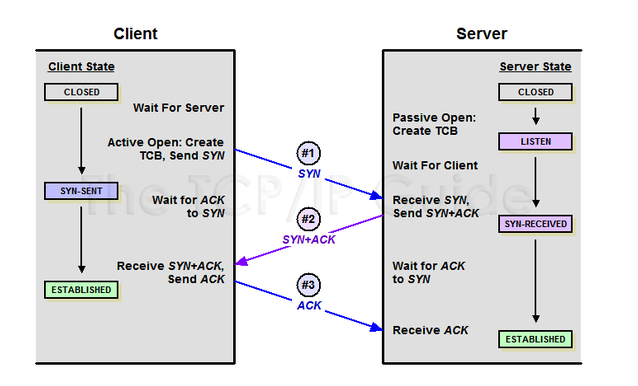
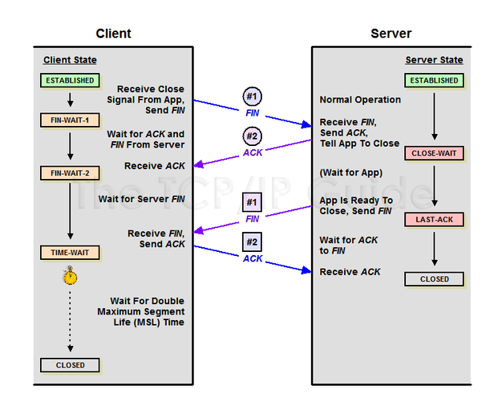

### TCP 3-way Handshake 란?

TCP는 장치들 사이에 논리적인 접속을 성립하기 위해 사용한다.

TCP 연결을 초기화 할 때 사용한다

**TCP 3 Way Handshake는 TCP/IP프로토콜을 이용해서 통신을 하는 응용프로그램이 데이터를 전송하기 전에  먼저 정확한 전송을 보장하기 위해 상대방 컴퓨터와 사전에 세션을 수립하는 과정을 의미한다.**

Client> Server: TCP SYN

Server> Client: TCP SYN, ACK

Client > Server: TCP ACK

 ### TCP 3-way Handshaking 과정
 
 
 
 ## STEP 1
 A 클라이언트는 B서벙에 접속을 요청하는 SYN 패킷을 보낸다.
 
 A 클라이언트는 SYN을 보내고 **SYN/ACK** 응답을 기다리는 **SYN_SENT** 상태, B서버는 **Wait for Client** 상태이다.
 
 ## STEP 2
 
 B서버는 SYN 요청을 받고 A클라이언트에게 요청을 수락한다는 ACK 와 SYN flag 가 살정된 패킷을 발송하고 A가 다시 ACK으로 응답하기를 기다린다.
 이때 B서버는 **SYN_RECEIVED** 상태가 된다.
 
 ## STEP 3
 
 A 클라이언트는 B 서버에게 ACK를 보낸 이후부터 연결이 이루어지고 데이터가 오가게 되는 것
 
 이때의 B 서버 상태는 **ESTABLISHED**
 
 
 
 #### TCP 4-way Handshake 란?
  

 4-Way handshake는 세션을 종료하기 위해 수행되는 절차
 
 
 TCP의 4-way Handshaking 과정
 
  ## STEP 1
 클라이언트가 연결을 종료하겠다는 FIN 플래그를 전송한다. 이때 A 클라이언트는 FIN- WAIT 상태가 된다
 
 ## STEP 2
 
 B 서버는 FIN 플래그를 받고, 일단 확인 메시지 ACK를 보내고 자신의 통신이 끝날때까지 기다리는데 이 상태가 B서버의 CLOSE_WAIT 상태이다
 
 ## STEP 3
 
 연결을 종료할 준비가 되면, 연결해지를 위한 준비가 되었음을 알리기 위해 클라이언트에게 FIN 플래그를 전송한다. 이때 B서버의 상태는 LAST_ACK이다.
 
  ## STEP 4
 클라이언트는 해지준비가 되었다는 ACK를 확인했다는 메시지를 보낸다.

A클라이언트의 상태가 FIN-WAIT ->TIME-WAIT 으로 변경된다.

 

