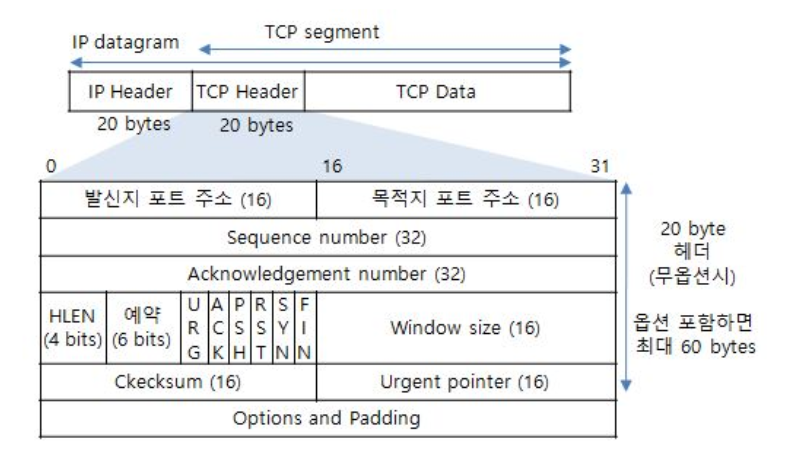
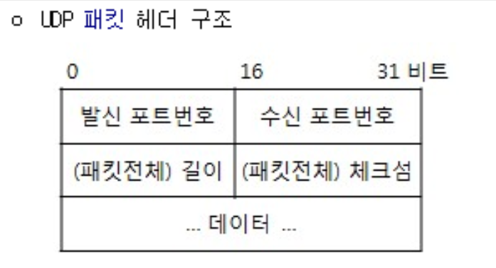

### TCP header

송수신자의 포트 번호	TCP로 연결되는 가상 회선 양단의 송수신 프로세스에 할당되는 포트 주소	16

시퀀스 번호(Sequence Number)	송신자가 지정하는 순서 번호, 전송되는 바이트 수를 기준으로 증가.

SYN = 1 : 초기 시퀀스 번호가 된다. ACK 번호는 이 값에 1을 더한 값.

SYN = 0 : 현재 세션의 이 세그먼트 데이터의 최초 바이트 값의 누적 시퀀스 번호	32

응답 번호(ACK Number)	수신 프로세스가 제대로 수신한 바이트의 수를 응답하기 위해 사용.	32

데이터 오프셋(Data Offset)	TCP 세그먼트의 시작 위치를 기준으로 데이터의 시작 위치를 표현(TCP 헤더의 크기)	4

예약 필드(Reserved)	사용을 하지 않지만 나중을 위한 예약 필드이며 0으로 채워져야한다.	6

제어 비트(Flag Bit)	SYN, ACK, FIN 등의 제어 번호 -> 아래 추가 설명 참조	6

윈도우 크기(Window)	수신 윈도우의 버퍼 크기를 지정할 때 사용. 0이면 송신 프로세스의 전송 중지	16

체크섬(Checksum)	TCP 세그먼트에 포함되는 프로토콜 헤더와 데이터에 대한 오류 검출 용도	16

긴급 위치(Urgent Pointer)	긴급 데이터를 처리하기 위함, URG 플래그 비트가 지정된 경우에만 유효	16

### UDP header

1) 발신 포트번호(Source port) : TCP와 동일한 필드영역으로, 16bit 크기를 가진다.

2) 수신 포트번호(Destination port) : TCP와 동일한 필드 영역으로, 16bit 크기를 가진다.

3) 길이(UDP Header Length) : UDP 헤더가 붙은 패킷 전체 길이를 바이트로 담는다. 헤더만 있을 경우 최소값은 8이된다.

4) 체크섬(Check sum) : 오류를 체크하는 기능이며, TCP에서는 오류가 발견되면 재전송이 가능하지만 UDP는 그냥 알고 넘어갈 뿐이다.

